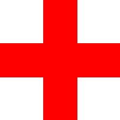
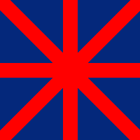

# 3个绘图作业的实现效果和思路

## 1. 红色十字
实现的效果如下：



假设图片是`200x200`的，红色十字的宽度为`60`。

红十字的横竖中间线可以抽象为2个函数：

```
X = 100
Y = 100
```

点的颜色为红色的点`(x, y)`范围是：

```
100 - 60/2 <= x <= 100 + 60/2
// 或者
100 - 60/2 <= y <= 100 + 60/2
```

其余范围的点的颜色为白色。

## 2. 米字
实现的效果如下：



`1`中已经实现的米字中的十字部分，现在只需要实现2条斜线。
然后把米字宽度范围内的点绘制为红色，其他点绘制为蓝色。

假设图片是`200x200`的，红色十字的宽度为`60`


直线的两点式如下，已知2点 `(x1,y1)` `(x2,y2)`

```
(X - x1)/(x2 - x1) = (Y - y1)/(y2 - y1)
```

通过2点式，可以推导标准直线方程 `Ax + By +C = 0`其中：

```
A = 1/(x2-x1)
B = 1/(y1-y2)
C = y1/(y2-y1) - x1/(x2-x1)
```

点`(x0, y0)`到直线(`Ax + By +C = 0`)距离公式 

```
abs(A*x0 + B*y0 + C) / (sqrt(A^2+B^2))
```

然后把点到直线距离小于等于30的颜色设置为红色。

其中米字的2条斜线可以通过2点确定：

* 左上到右下： `(0, 200)`, `(200, 0)`
* 左下到右上： `(0, 0)`, `(200, 200)`


## 3. 日本国旗 (红色的圆)

实现的效果如下：


思路：到圆心的距离 <= 半径r 的点为红色，其他点为白色。